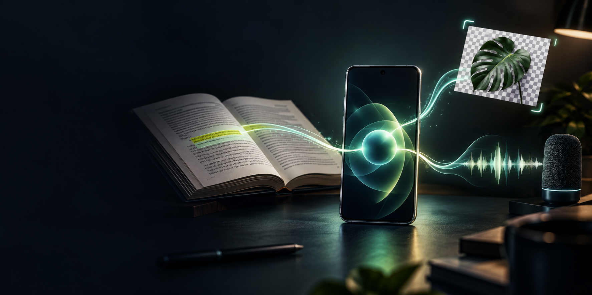

# Subra AI

### Your ideas. Your AI. On your device.

Subra AI is a private mobile AI workspace for everyday questions, images, voice, and learning with your own materials. Download a compatible model once, then use the on-device AI without sending every conversation to a cloud chatbot.

**Get the app:** [Request Android Google Play access](https://www.instagram.com/subraatakumar/) · [Check Android APK releases](https://github.com/TechCraft-By-Subrata/subra-ai/releases) · [Get Subra AI for iPhone](https://apps.apple.com/us/app/subra-ai-private-offline-ai/id6791144948)

> **Android early access:** The app is still being tested, and some features differ from iOS. The GitHub APK is available only after a release with an APK asset has been published. If there is no release yet, use the Google Play request path below.

## What can I do with it?

- **Chat privately:** Ask questions and work through ideas with an on-device model. Add an image when a picture provides useful context.
- **Study your own material:** Add PDFs, text files, images, and lecture audio to the local Learning Vault. Learning Chat searches relevant material before answering and can reference sources where available. Always check important answers against the original.
- **Capture your voice:** Record or attach audio and turn speech into text. Listen to AI replies using an installed device voice.
- **Make images useful:** Remove an image background, compare the result, refine difficult edges, and save with a transparent, plain, or replacement background.
- **Keep control:** Manage local chat history, AI Memory, response language and style, and downloaded models.

The experience depends on your device and model. [Explore the product and screenshots](https://subraatakumar.com/subra-ai) or [see how Learning Lens works](https://subraatakumar.com/subra-ai-use-cases/study-with-your-own-materials).

## Get Subra AI on Android

### Option 1 — Google Play early access

[DM @subraatakumar on Instagram](https://www.instagram.com/subraatakumar/) and ask to join the **Subra AI Android early-access group**. After you are added, install the app from Google Play; Play handles subsequent app updates.

### Option 2 — Download the official APK

1. Open [GitHub Releases](https://github.com/TechCraft-By-Subrata/subra-ai/releases).
2. Choose a published Android release and download the `.apk` file under **Assets**. If no APK is listed, there is nothing to download yet.
3. Open the file on your Android device. Android may ask you to allow installs from your browser or file manager. Grant that permission only if you trust the source.
4. Open Subra AI and download a compatible local AI model before using model-powered features.

Only download an APK from this repository's official Releases page. An APK installed outside Google Play may require you to return here and install future updates manually. You can turn off the temporary “install unknown apps” permission after installation.

## Privacy and practical limits

Subra AI's on-device chat and Learning Vault are designed to process private material locally. Downloading models and app updates requires an internet connection, and anything you explicitly share or export leaves your device through the destination you choose. [Read the privacy policy](https://subraatakumar.com/subra-ai/privacy-policy).

AI answers can be wrong, including source references. Learning Lens is a study aid, not a substitute for checking your notes, textbook, or recording. Some features may be unavailable on Android while early access continues; for example, the iOS-only “Add Audio 2” live-transcription option is not in the Android Vault.

## Feedback

Found a problem? [Open an issue](https://github.com/TechCraft-By-Subrata/subra-ai/issues) with your device model, Android version, app version, and steps to reproduce. Please **do not attach private chats, recordings, images, or Vault files**. You can also [contact the developer](https://subraatakumar.com/contact).

---

This public repository distributes official Android APKs and release notes. It is **not** the app's source-code repository, and its presence on GitHub does not make Subra AI open source.
